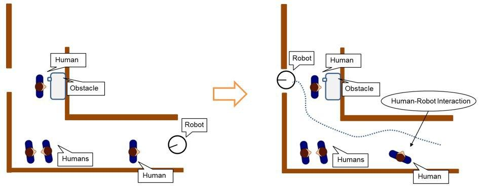
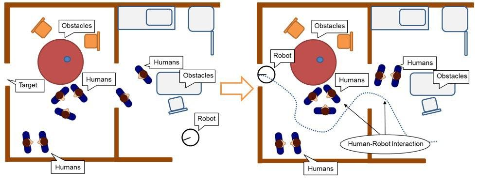
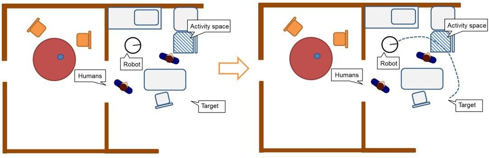
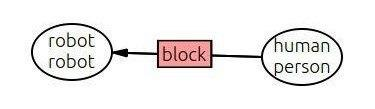
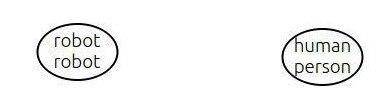
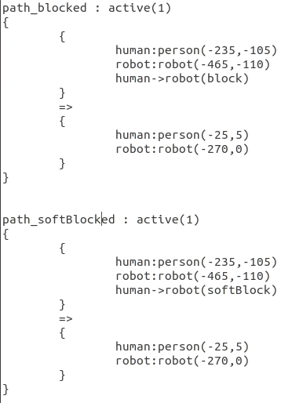

# Usecases and Writing Mission Files

## Usecases

### Case 1: Block
  
In this case the user is blocking the path of the robot. The robot has no alternate path to complete its mission. A dialogue will be opened by the robot asking the person to move aside and let him pass.

### Case 2: Soft Block
  
In this case two people are conversing while blocking the robot's path, having no alternative path to travel the robot will have to interrupt their conversation and ask them politely to let him pass.

### Case 3: Affordance Block
  
In this case a person is intracting with an object while blocking the robot's path, even though not wanting to interrupt the person,, the robot opens a dialogue with the person asking him politely to just move aside for a minute and let him pass.

**The chatbot has been trained on the above three usecases**

## Writing Mission Files
**What is Mission**
Mission is the task which robot plans to complete for example in the first case above, the robot's mission is to eliminate the blocked link with the person.  
The mission statements are written in .aggl file and the final state which we want to achieve is written in .aggt file.  
The .aggl file is generated using ***agglEditor***, in which you draw graphs according to usecases and it generates the code for them in the file.
**AGGLPlanner picture for usecase 1:**  
   

**.aggl file generated for above graph:**  
   

When you set a Mission and the initial conditions are full filled, a plan is generated by an automated task planner based on graph models called ***AGGLPlanner*** and sent to my component *conversationalAgent* containing the **activation parameters** for the agent. The parameters recieved will be used to launch a conversation with the person. 

***
Rishi Gondkar