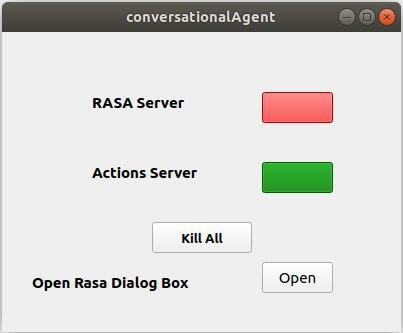
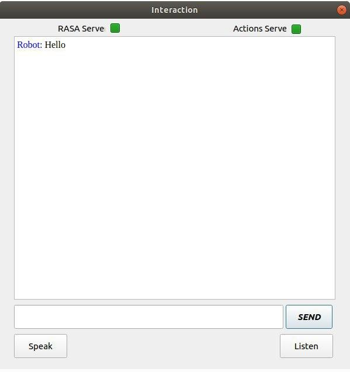
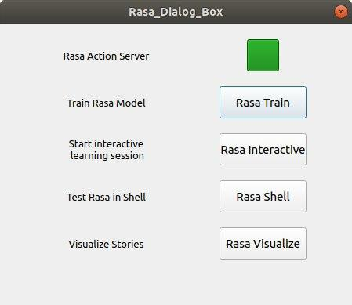

# GUI for conversationalAgent

## Main GUI
  

This is the Main UI of my component, it starts when you start the component.  
Following are the functions of the buttons:
* **Rasa Server:** This button is for starting or killing the Rasa Server. It is a color coded button, Red implies the server is offline and Green colour implies Server is active.

* **Action Server:** This button is for starting or killing the Action Server. It is a color coded button, Red implies the server is offline and Green colour implies Server is active.

* **Kill All:** This button is to kill both Rasa and Action Servers.

* **Open Rasa Dialog Box:** This button is to open the Rasa Dialog box. The Rasa Dialog box contains multiple functions, which will be explained later in the blog.

> Closing this Main window will call the Agent destructor, terminating the Agent.

## Interaction GUI
  

This UI becomes visible when my agent is activated by Mission Agent. It is similar to a Texting application which is used to send and recieve messages between the robot and the person.  
Following are the functions of the buttons:
* **Rasa Server:** This button is only for starting the Rasa Server. It is a color coded button, Red implies the server is offline and Green colour implies Server is active. The button can only start the Rasa server if its offline and not kill it.

* **Action Server:** This button is only for starting the Action Server. It is a color coded button, Red implies the server is offline and Green colour implies Server is active. The button can only start the Action server if its offline and not kill it.

* **Send Button:** This button is to Send the message you have typed to the robot, an alternate method to send the message is to press Enter key.

* **Speak Button:** This button is to start voice recognition. You can speak till the label besides the button displays recording.

* **Listen Button:** This button is to convert the last message recieved from the robot to Audio and play it.

## Rasa GUI
  

This UI becomes visible when You press the **Open Rasa Dialog Box** on the ***Main GUI***. It contains buttons to which execute a few useful Rasa commands making it easier for user while working with the chatbot.  
Following are the functions of the buttons:
* **Action Server:** This button is for starting or killing the Action Server. It is a color coded button, Red implies the server is offline and Green colour implies Server is active.

* **Rasa Train:** This button is for training the chatbot on the new data you have added in the stories, NLU or domain files.

* **Rasa Interactive:** This button is to start an interactive session for generating new data, similar to *Wizard of Oz* experimental strategy for Human-Computer Interaction.

* **Rasa Shell:** This button is to start the chatbot in a shell. It can be used for testing the chatbot you have trained. This button will also auto activate the Action server if it is offline.

* **Rasa Visualize:** This button creates a visualization of all the story paths you have trained the model on. It creates a flowchart connecting the intents, actions and slots. A HTML file is generated which opens in the browser on you computer.

***
Rishi Gondkar

