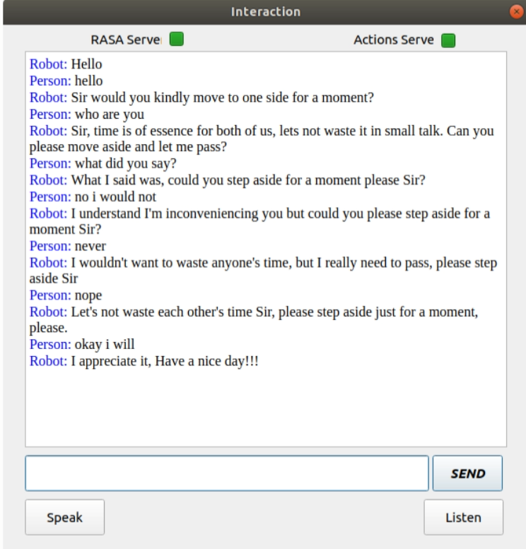

# Final Post
This is the final post in the series of posts describing the work done in GSoC.

## Work Done
I have written documentation for my code as well as creates an instDep.sh file to install all the dependencies for the agent.
After testing the code I have created a pull request to merge my code into robocomp-viratio repository.
All the task proposed for this project have been successfully completed.

## Final Work Product

### conversationalAgent:
* Pull Request: [Link](https://github.com/robocomp/robocomp-viriato/pull/3)

## Example of Final simulated conversation

  

## Future Scope

* The chatbot created can be extended to more use cases.

* Therapy or other non-navigational chatbots can also be created and integrated.

## Learnings

This experience has given me immense learnings:

1. Write clean code and develop solutions which are complete without using any work-arounds
2. Using git effectively
3. Writing documentation
4. Designing good structured code which is extensible
5. Writing Tests for my code
6. Work in a collaborative environment which required soft skills

I would like to Thank both my mentors who always guided me and encouraged me to work harder.

***
Rishi Gondkar